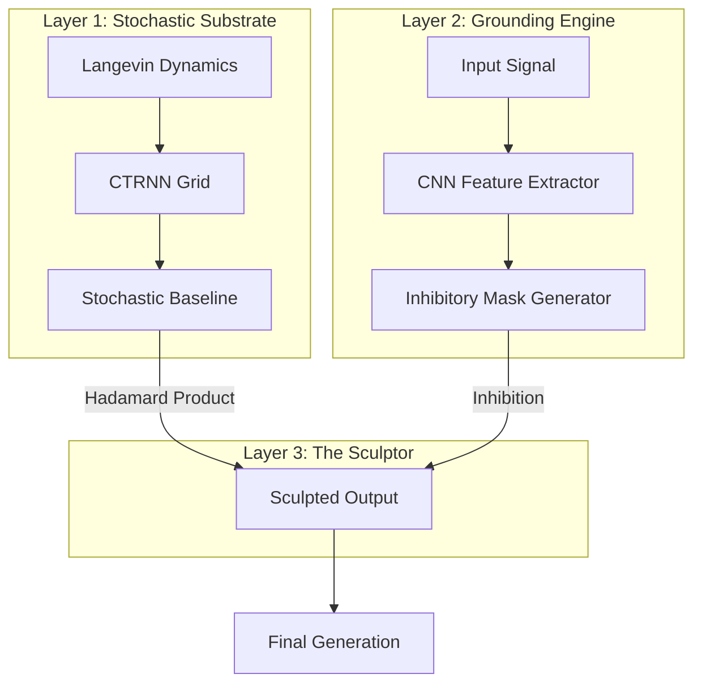

# ARCHITECTURE.md

## System Overview

The Inhibitory Generative Network (IGN) is a hierarchical model designed for subtractive signal generation. It consists of three primary functional layers that transform stochastic noise into grounded representations.

## Layer 1: The Stochastic Substrate
- **Purpose**: Generates the "raw material" (noise) for the system.
- **Components**:
    - `LangevinDynamics`: Provides continuous-time stochastic fluctuations.
    - `CTRNNGrid`: A 2D grid of recurrent neurons with local connectivity.
- **Physics**: Governed by the Euler-Maruyama integration of the SDE:
  $dx_t = f(x_t)dt + g(t)dW_t$

## Layer 2: Meta-Logical Grounding Engine
- **Purpose**: Interprets context and creates constraints (masks).
- **Components**:
    - `CNN`: Extracts hierarchical features from input signals (e.g., images).
    - `GroundingBlock`: Maps high-dimensional features to the spatial dimensions of the Layer 1 grid.
- **Output**: A tensor $M \in [0, 1]^{H \times W}$ where 0 is full inhibition and 1 is full transparency.

## Layer 3: The Sculptor
- **Purpose**: Executes the inhibition.
- **Operation**:
  $O = S \odot M$
  Where $S$ is the substrate activity and $M$ is the inhibitory mask.
- **Thresholding**: Post-masking clipping ensures the output remains within stable dynamic ranges.

## Implementation Details
- **Framework**: Built entirely in **JAX** and **Equinox**.
- **Vectorization**: Uses `jax.vmap` for batching and `jax.lax.scan` for temporal simulation.
- **Typing**: Strict type hints using `jaxtyping` and `beartype` for tensor shape validation.

## Neuromorphic Potential
The architecture is designed to be "Loihi-ready":
1. **Asynchronous**: Layers operate on continuous-time dynamics.
2. **Local**: Layer 1 uses local spatial connectivity.
3. **Sparsity**: Inhibition naturally leads to sparse activity patterns.
